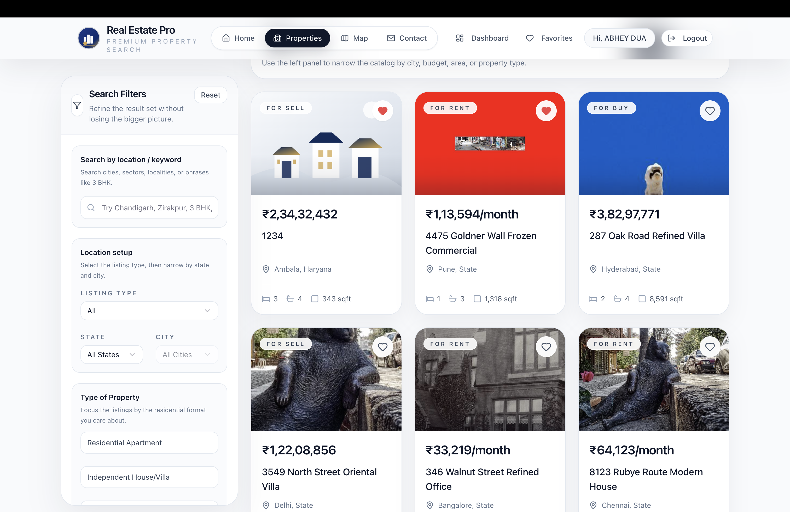
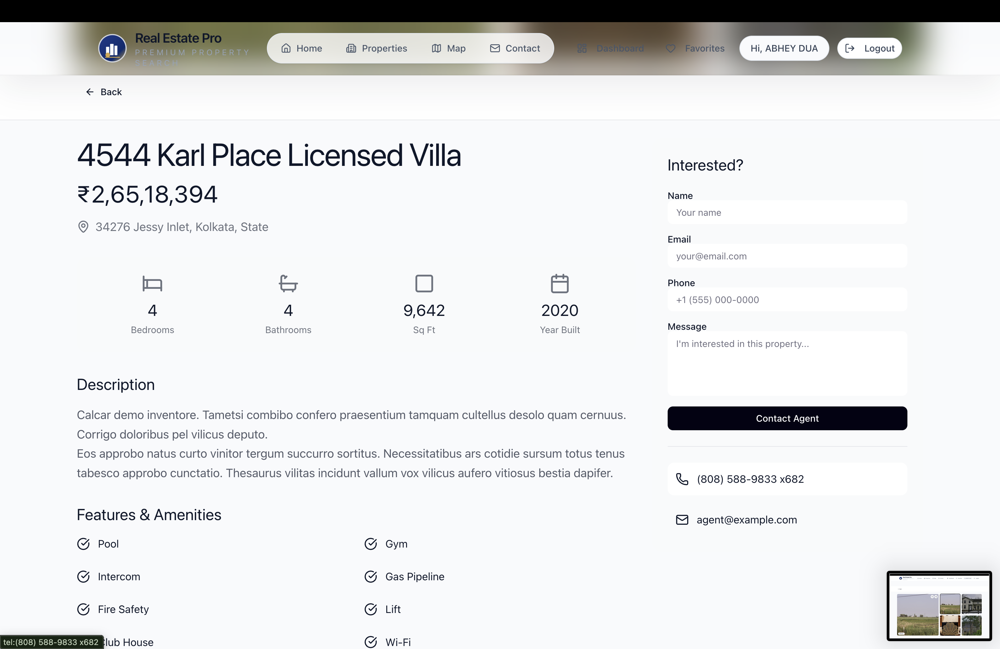
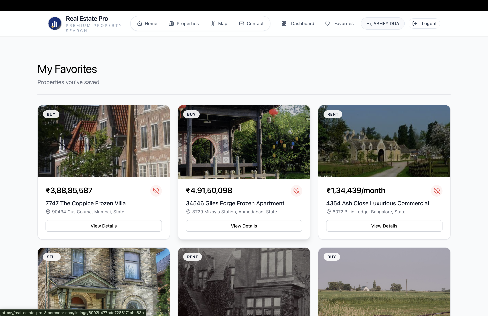
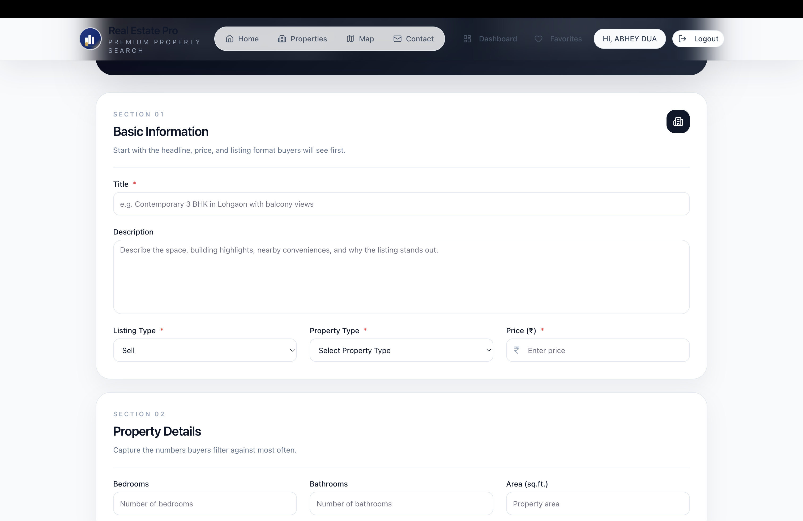
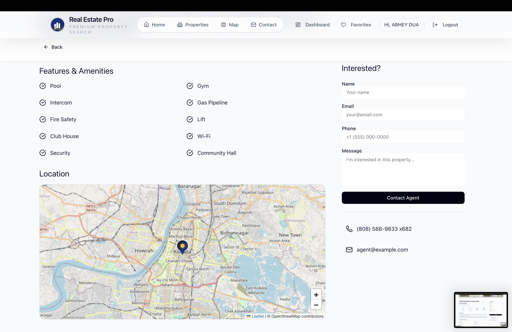
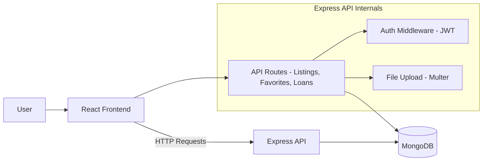
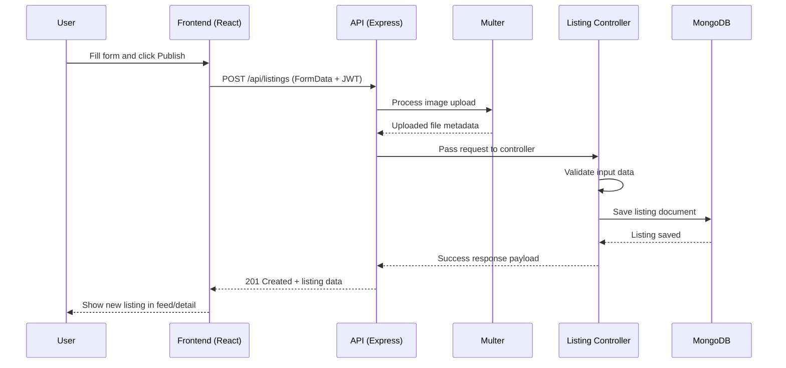
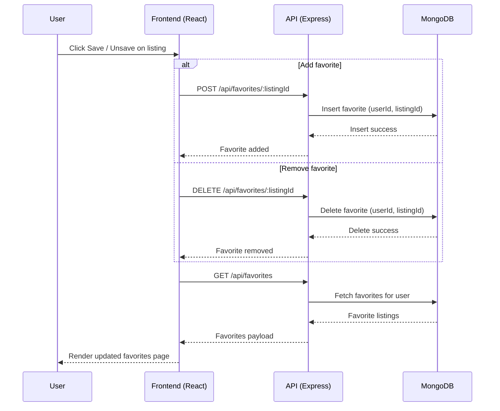
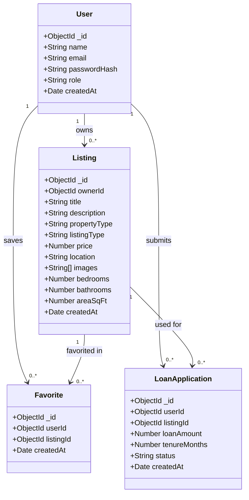

# Real Estate Pro — Full-Stack Property Platform

Real Estate Pro is a full-stack real estate application that enables users to discover, explore, and manage property listings through an integrated web platform. It combines map-based navigation, structured listing data, and user-driven actions such as saving properties and creating listings.

---

## Demo

🎥 **2-minute walkthrough:** *(Add your Drive link here)*

This video covers:

- Property discovery (grid + map)
- Listing details
- Favorites system
- Listing creation flow
- System overview

---

## Problem & Motivation

Real estate platforms are often fragmented across discovery, mapping, and user interaction layers. Users switch between tools to browse listings, view locations, and manage saved properties.

Real Estate Pro consolidates these into a single platform:

- Centralized listing discovery
- Map-integrated navigation
- User-managed listings and favorites

---

## Key Features

- Property browsing with filters (price, type, location)
- Map-based exploration using geolocation
- Detailed listing pages with images and metadata
- Favorites system for saving listings
- Create / update / delete listings (authenticated users)
- Loan application system
- Contact and location interface
- RESTful backend with JWT authentication

---

## Product Walkthrough

### Home


---

### Properties (Search + Filters)



Users can filter listings based on:

- Price range
- Property type
- Location

---

### Map View


Listings can be explored geographically using an interactive map interface.

---

### Listing Detail



Each listing includes:

- Image gallery
- Price and specifications
- Location map
- Property details

---

### Favorites



Users can save and manage listings for later reference.

---

### Create Listing



Authenticated users can:

- Upload images
- Add structured property data
- Publish listings

---

### Contact



---

## Architecture Overview

The application follows a typical MERN architecture with a clear separation between frontend, backend, and database layers.



---

## Core User Flows

### Property Discovery

User browses listings → applies filters → switches to map → selects property

---

### Create Listing Flow

1. User fills listing form
2. Images uploaded via Multer
3. Backend validates input
4. Data stored in MongoDB
5. Listing becomes available in feed



---

### Favorites Flow

1. User clicks “Save”
2. API stores relation (user ↔ listing)
3. Favorites page reflects saved data



---

## Repository Structure

```text
Real_Estate_Pro/
├── client/                 # React frontend
│   ├── src/
│   │   ├── pages/
│   │   ├── context/
│   │   ├── utils/
│   │   └── App.tsx
│   └── package.json
│
├── server/                 # Express backend
│   ├── src/
│   │   ├── routes/
│   │   ├── controllers/
│   │   ├── models/
│   │   └── middleware/
│   └── package.json
│
├── render.yaml
└── env.example.txt
```

---

## Backend Overview

The backend handles:

- REST API endpoints
- Authentication (JWT)
- File uploads (Multer)
- Data validation
- Database interaction via Mongoose

Key modules:

- `authRoutes` → authentication
- `listingRoutes` → property management
- `favoriteRoutes` → saved listings
- `loanRoutes` → loan applications

---

## Frontend Overview

The frontend is built with React and provides:

- Page-based navigation using React Router
- State management via Context API
- UI styling with Tailwind CSS
- Map integration using Leaflet

Key components:

- Pages → user flows
- Context → authentication state
- Utilities → API handling

---

## Data Model Overview

Entities:

- **User**
- **Listing**
- **Favorite**
- **LoanApplication**

Relationships:

- User → Listings (owner)
- User ↔ Favorite ↔ Listing
- User → LoanApplication → Listing



---

## API Overview

| Module    | Purpose                    |
| --------- | -------------------------- |
| Auth      | Register / Login / Profile |
| Listings  | CRUD operations            |
| Favorites | Save / remove listings     |
| Loans     | Apply for loans            |

---

## Tech Stack

**Frontend**

- React 18
- React Router
- Tailwind CSS
- Leaflet

**Backend**

- Node.js
- Express

**Database**

- MongoDB (Mongoose)

**Other**

- JWT Authentication
- Multer (file uploads)
- express-validator

---

## Local Setup

```bash
# Install all dependencies
npm run install:all

# Run project
npm start
```

---

## Environment Variables

```env
DATABASE_URL=mongodb+srv://<user>:<pass>@<cluster>/<db>
JWT_SECRET=your_secret
PORT=3000
REACT_APP_API_URL=http://localhost:3000/api
```

---

## Deployment

- Configured using `render.yaml`
- Backend and frontend deployed via Render
- MongoDB Atlas used for production database

---

## Future Improvements

- Advanced filtering (AI-based recommendations)
- Pagination and performance optimization
- Improved UI/UX design system
- Image optimization and CDN integration

---

## Final Note

Real Estate Pro demonstrates a complete full-stack system with real-world features including CRUD operations, authentication, map integration, and media handling, making it a strong representation of production-oriented web development.
